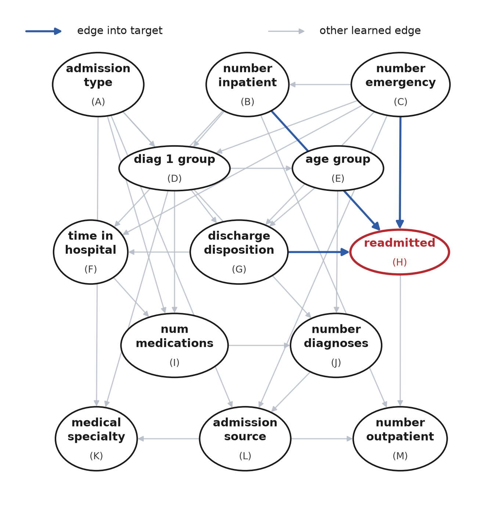
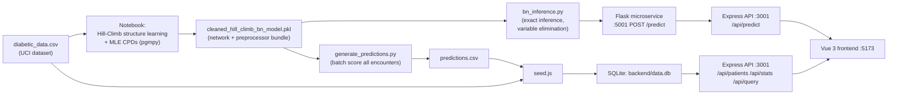

# Diabetic Readmission Risk Dashboard

A full-stack application that trains a **Bayesian Network** on the UCI *Diabetes 130-US Hospitals*
dataset and serves its readmission-risk predictions through an interactive dashboard: browse and
filter 100k+ patient encounters, query them with plain-English prompts, and run live "what-if"
predictions against the trained model.

- **Model:** Discrete Bayesian Network, structure learned with **Hill-Climb search** and CPDs fit with
  MLE, trained in Python with [`pgmpy`](https://pgmpy.org/) (`notebooks/`)
- **Backend:** Node.js + Express + SQLite (`better-sqlite3`), with a small Flask/Python microservice
  that loads the trained model and runs exact inference (variable elimination) per request
- **Frontend:** Vue 3 + Vite + Tailwind CSS + PrimeVue + Chart.js
- **Prompt query:** natural-language prompts are parsed into structured SQL filters, either by a
  deterministic rule-based parser or (optionally) an LLM

<p align="center">
  
</p>

## Table of contents

- [Dataset & references](#dataset--references)
- [Project structure](#project-structure)
- [How it works](#how-it-works)
- [Showcase](#showcase)
- [Quick start](#quick-start)
- [Using the Colab-trained model](#using-the-colab-trained-model)
- [API reference](#api-reference)
- [License](#license)

## Dataset & references

This project uses the **Diabetes 130-US Hospitals for Years 1999-2008** dataset, hosted on the UCI
Machine Learning Repository. It contains 101,766 de-identified hospital encounters for diabetic
patients across 130 US hospitals, with ~50 features covering demographics, diagnoses, lab
procedures, medications, and the target variable `readmitted` (`NO`, `<30`, `>30` days).

- **Dataset:** Clore, J., Cios, K., DeShazo, J., Strack, B. (2014). *Diabetes 130-US Hospitals for
  Years 1999-2008* [Dataset]. UCI Machine Learning Repository.
  [https://doi.org/10.24432/C5230J](https://doi.org/10.24432/C5230J)
- **Source article:** Strack, B., DeShazo, J. P., Gennings, C., Olmo, J. L., Ventura, S., Cios, K. J.,
  & Clore, J. N. (2014). *Impact of HbA1c Measurement on Hospital Readmission Rates: Analysis of
  70,000 Clinical Database Patient Records*. BioMed Research International, 2014, 781670.
  [https://doi.org/10.1155/2014/781670](https://doi.org/10.1155/2014/781670)
- **Modeling library:** Ankan, A., & Panda, A. (2015). *pgmpy: Probabilistic Graphical Models using
  Python*. [https://pgmpy.org/](https://pgmpy.org/)

<details>
<summary>BibTeX</summary>

```bibtex
@misc{diabetes130,
    author = {Clore, John and Cios, Krzysztof and DeShazo, Jon and Strack, Beata},
    title = {Diabetes 130-{US} Hospitals for Years 1999-2008},
    year = {2014},
    publisher = {UCI Machine Learning Repository},
    doi = {10.24432/C5230J},
    url = {https://archive.ics.uci.edu/dataset/296/diabetes+130-us+hospitals+for+years+1999-2008},
}

@article{strack2014impact,
    author = {Strack, Beata and DeShazo, Jonathan P. and Gennings, Chris and Olmo, Juan L. and Ventura, Sebastian and Cios, Krzysztof J. and Clore, John N.},
    title = {Impact of {HbA1c} Measurement on Hospital Readmission Rates: Analysis of 70,000 Clinical Database Patient Records},
    journal = {BioMed Research International},
    volume = {2014},
    pages = {781670},
    year = {2014},
    doi = {10.1155/2014/781670},
    url = {https://doi.org/10.1155/2014/781670},
}

@misc{pgmpy,
    author = {Ankan, Ankur and Panda, Abinash},
    title = {pgmpy: Probabilistic Graphical Models using Python},
    year = {2015},
    url = {https://pgmpy.org/},
}
```

</details>

The full write-up (methodology, structure-learning comparison, evaluation) is in
[`report/main.pdf`](report/main.pdf), and the accompanying presentation assets are kept locally
(not tracked in this repo — see [`.gitignore`](.gitignore)).

## Project structure

```
.
├── diabetic_data.csv         # Raw UCI dataset (101,766 encounters)
├── description.pdf           # Official UCI feature/codebook description
├── report/                   # Project report (LaTeX source + compiled PDF + figures)
├── notebooks/
│   ├── bayesian-network-raw-hill-climb.ipynb      # BN over raw (unbinned) features
│   └── bayesian-network-cleaned-hill-climb.ipynb  # BN over cleaned/binned features (used in prod)
├── backend/                   # Express API
│   ├── model/
│   │   ├── bn_inference.py           # Loads the pkl bundle, runs exact inference per request
│   │   ├── server.py                 # Flask microservice wrapping bn_inference (POST /predict)
│   │   ├── colab_export.py           # Paste into Colab to train + export model files
│   │   ├── generate_predictions.py   # Batch-scores diabetic_data.csv -> predictions.csv
│   │   ├── cleaned_hill_climb_bn_model.pkl  # Trained model bundle (pgmpy network + preprocessor)
│   │   ├── predictions.csv           # Pre-computed predictions for every encounter (used to seed SQLite)
│   │   └── requirements.txt
│   ├── scripts/seed.js        # Loads the CSV + predictions.csv into SQLite
│   ├── src/
│   │   ├── database.js        # SQLite schema
│   │   ├── services/bnModel.js    # Spawns/health-checks the Python model microservice
│   │   ├── routes/
│   │   │   ├── patients.js    # Patient search & prediction-lookup endpoints
│   │   │   ├── predict.js     # Live inference endpoint (calls the Python microservice)
│   │   │   ├── stats.js       # Dataset statistics & chart data
│   │   │   └── query.js       # Natural-language -> SQL query endpoint
│   │   └── server.js
│   └── package.json
├── frontend/                  # Vue 3 SPA
│   └── src/
│       ├── views/
│       │   ├── Dashboard.vue     # Patient search, filters, risk cards
│       │   ├── PromptQuery.vue   # Natural-language query UI
│       │   ├── Predict.vue       # Live "what-if" prediction form
│       │   └── Dataset.vue       # Dataset showcase with charts
│       └── services/api.js       # Axios backend client
└── run.sh                     # Boots backend + frontend together for local dev
```

## How it works



1. **Training (offline, notebooks):** `notebooks/bayesian-network-cleaned-hill-climb.ipynb` bins/cleans
   the raw features into 12 categorical variables, runs `pgmpy`'s Hill-Climb search with a BIC/BDeu
   score to learn the network's DAG structure, fits CPDs with MLE, and evaluates on a held-out split.
   The trained network, the fitted preprocessor, and evaluation metrics are pickled into
   `backend/model/cleaned_hill_climb_bn_model.pkl`. A second notebook
   (`bayesian-network-raw-hill-climb.ipynb`) repeats the exercise on unbinned/raw features for
   comparison (see the report for the accuracy/interpretability trade-off discussion).
2. **Batch scoring:** `generate_predictions.py` loads that pickle and scores every one of the 101,766
   encounters in `diabetic_data.csv`, producing `predictions.csv` (`prob_no`, `prob_lt30`, `prob_gt30`,
   `risk_score`, `risk_class`, ...).
3. **Seeding:** `backend/scripts/seed.js` joins the raw CSV with `predictions.csv` (or falls back to a
   simple heuristic if predictions aren't present) into a local SQLite database that the API queries.
4. **Live inference:** for the **Predict** page, the Express backend (`src/services/bnModel.js`)
   auto-spawns a small Flask microservice (`backend/model/server.py`) that keeps the model resident in
   memory and answers `POST /predict` with an actual forward pass (variable elimination) through the
   learned CPDs — not a cached lookup.
5. **Prompt query:** free-text prompts are parsed into structured filters (age, gender, risk class,
   readmission status, insulin/medication use, numeric thresholds, sort order) by a deterministic
   rule-based parser (`parseNaturalLanguage` in `query.js`). If a `NIM_API_KEY` is configured (see
   [`.env.example`](backend/.env.example)), the same prompt is instead sent to an LLM
   (NVIDIA NIM, `openai/gpt-oss-120b`) which returns the same structured schema — with the rule-based
   parser as an automatic fallback on any API error.
6. **Frontend:** the Vue SPA calls the Express API to render the patient table, dataset charts, prompt
   results, and prediction form.

## Showcase

The dashboard has four pages, all sharing the same dark-mode-aware layout:

| Page | Route | What it does |
|---|---|---|
| **Patients** | `/` | Filter/sort/paginate all 101,766 encounters (age, gender, race, risk class, readmission status, insulin, ...) and see each patient's model-predicted risk. |
| **Prompt Query** | `/prompt` | Type a request like *"high risk female patients over 60 on insulin readmitted within 30 days"*; the backend parses it into filters, runs the query, and shows an aggregate readmission prediction for the matching cohort. |
| **Predict** | `/predict` | Build a custom patient profile (admission type/source, discharge disposition, diagnosis category, utilization counts) and get a live prediction straight from the trained Bayesian Network via exact inference. |
| **Dataset** | `/dataset` | Summary statistics and charts (readmission rate, risk distribution, age/gender/race breakdowns, top medical specialties, medication usage) computed over the whole dataset. |

### Example: live "what-if" prediction

Request sent by the **Predict** page (`POST /api/predict`):

```json
{
  "query": {
    "age_group": ">60",
    "admission_type": "Emergency",
    "admission_source": "Emergency room",
    "discharge_disposition": "Discharged to home",
    "diag_1_group": "Circulatory",
    "medical_specialty": "Cardiology",
    "number_inpatient": 2,
    "number_outpatient": 0,
    "number_emergency": 1,
    "number_diagnoses": 9,
    "time_in_hospital": 4,
    "num_medications": 18
  }
}
```

The Python microservice runs this through the learned network with `pgmpy`'s variable elimination and
returns:

```json
{
  "predicted_class": "NO",
  "probabilities": { "NO": 0.7423, "<30": 0.1186, ">30": 0.1391 },
  "risk_score": 0.1109,
  "risk_class": "medium",
  "risk_label": "Moderate risk"
}
```

Switching to the "high-risk example" preset (older patient, emergency admission, multiple prior
inpatient/emergency visits, discharge to a skilled nursing facility) shifts the predicted distribution
toward `<30`, visibly raising the risk score and risk badge in the UI.

### Example: natural-language prompt query

Request sent by the **Prompt Query** page (`POST /api/query/execute`):

```json
{ "prompt": "high risk female patients over 60 on insulin readmitted within 30 days" }
```

Parsed filters returned alongside the matching patients and an aggregate cohort prediction:

```json
{
  "query": {
    "filters": {
      "age": ["[60-70)", "[70-80)", "[80-90)", "[90-100)"],
      "gender": ["Female"],
      "risk_class": ["high"],
      "readmitted": ["<30"],
      "insulin": ["Up", "Down", "Steady"]
    },
    "sortBy": "risk_score",
    "order": "desc",
    "explanation": "Querying patients with age over 60, female patients, high readmission risk, readmitted within 30 days, on insulin."
  },
  "promptPrediction": {
    "cohortSize": 214,
    "predictedClass": "<30",
    "readmissionProbability": 0.83,
    "riskScore": 0.71,
    "riskClass": "high"
  }
}
```

### Example: dataset statistics

`GET /api/stats/summary` powers the **Dataset** page's charts:

```json
{
  "total": 101766,
  "readmissionRate": 0.4657,
  "within30Rate": 0.1116,
  "riskDistribution": [
    { "risk_class": "low", "count": 61294 },
    { "risk_class": "medium", "count": 28840 },
    { "risk_class": "high", "count": 11632 }
  ],
  "avgHospitalTime": 4.4,
  "avgRiskScore": 0.1523
}
```

## Quick start

The simplest way to run everything locally is the bundled script, which installs dependencies (Node +
Python venv), starts the backend (which auto-spawns the Python model microservice) and the frontend
dev server, and streams both logs:

```bash
./run.sh
```

- Frontend: `http://localhost:5173`
- Backend API: `http://localhost:3001`
- Model microservice: `http://localhost:5001` (started automatically by the backend)

The first run needs a seeded database:

```bash
cd backend
npm install
npm run seed   # loads diabetic_data.csv + model/predictions.csv into backend/data.db
```

### Manual setup

```bash
# 1. Backend
cd backend
npm install
npm run seed
npm start            # or: npm run dev (nodemon)

# 2. Python model microservice deps (used by the backend automatically)
cd backend/model
python3 -m venv venv
./venv/bin/pip install -r requirements.txt

# 3. Frontend
cd frontend
npm install
npm run dev
```

### Optional: LLM-backed prompt parsing

By default, prompt queries are parsed by a deterministic rule-based parser — no API key needed. To use
an LLM instead, copy `backend/.env.example` to `backend/.env` and set `NIM_API_KEY` to an
[NVIDIA NIM](https://build.nvidia.com/) API key.

## Using the Colab-trained model

To retrain the model yourself (e.g. on Google Colab):

1. Open `notebooks/bayesian-network-cleaned-hill-climb.ipynb` in Colab and upload `diabetic_data.csv`.
2. Copy `backend/model/colab_export.py` into a Colab cell and run it.
3. Download the generated `bn_model.pkl` (rename to `cleaned_hill_climb_bn_model.pkl`),
   `predictions.csv`, and `features.json` into `backend/model/`.
4. Re-seed the database: `cd backend && npm run seed`.

If you only have the pickle and need to regenerate `predictions.csv` locally:

```bash
cd backend/model
./venv/bin/python generate_predictions.py
```

## API reference

- `GET /api/health` — health check
- `GET /api/patients/search?filters=...&page=...&limit=...&sortBy=...&order=...` — paginated patient search
- `GET /api/patients/:id` — patient details
- `POST /api/patients/predict` — pre-computed risk prediction for a patient by `encounter_id`
- `POST /api/predict` — **live** Bayesian Network inference for an arbitrary patient profile
- `GET /api/predict/health` — whether the Python model microservice is up
- `GET /api/stats/summary` — dataset summary statistics for the Dataset page
- `GET /api/stats/readmitted-by-feature/:feature` — crosstab statistics
- `POST /api/query/nlp` — parse a natural-language prompt into a structured query
- `POST /api/query/execute` — parse a prompt, run it, and return matching patients + cohort prediction

## License

The code in this repository is provided as-is for educational purposes. The dataset itself is subject
to the UCI Machine Learning Repository's terms of use — see the citations above.
